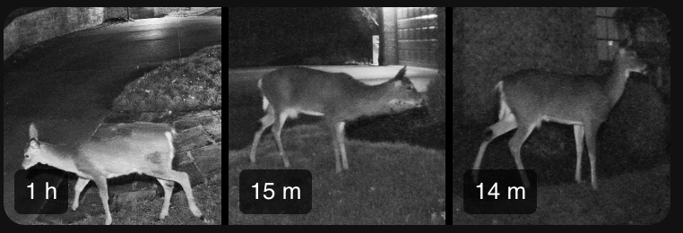

# ha-unifi-events

Display recent [UniFi Protect](https://ui.com/camera-security) AI detection thumbnails on your Home Assistant dashboard — persons, vehicles, animals, and packages — with instant updates via sensor triggers.



```yaml
type: custom:unifi-events-card
url: /local/unifi_events/recent.json
entity: sensor.unifi_detections_updated
count: 3
lightbox_count: 9
cols: 3
refresh_interval: 300
```

---

## Installation

### Prerequisites

- **HACS** installed ([instructions](https://www.hacs.xyz/docs/use/download/download/))
- **AppDaemon apps enabled in HACS**: Settings → Devices & Services → HACS → Configure → enable "AppDaemon apps discovery & tracking"
- **AppDaemon add-on** installed via Settings → Add-ons → Add-on Store → search "AppDaemon"

### Step 1 — Point AppDaemon at the HACS app directory (one-time)

By default AppDaemon stores apps in its own isolated config volume, separate from where HACS installs them. This one-time change aligns them. You only do this once, regardless of how many HACS AppDaemon apps you install.

From the Home Assistant CLI (e.g. the Proxmox console), type `login` to get a root bash shell:

```bash
vi /mnt/data/supervisor/addon_configs/a0d7b954_appdaemon/appdaemon.yaml
```

Find the `app_dir` line and change it to:

```yaml
app_dir: /homeassistant/appdaemon/apps
```

Save and exit. After this change, AppDaemon will look in the same directory that HACS uses, and you can manage `apps.yaml` via the File Editor.

### Step 2 — Install Python dependencies

Go to **Settings → Add-ons → AppDaemon → Configuration** and add:

```yaml
python_packages:
  - uiprotect
  - aiofiles
```

### Step 3 — Install this app via HACS

1. In HACS, click the three-dot menu (top right) → **Custom repositories**
2. Paste `https://github.com/wyne/ha-unifi-events`, set category to **AppDaemon**, click **Add**
3. Find "UniFi Recent Detections" in HACS and click **Download**

HACS will place the app at `/homeassistant/appdaemon/apps/recent_detections/`.

### Step 4 — Install the custom Lovelace card

1. Copy `unifi-events-card.js` to `/homeassistant/www/`
2. In Home Assistant, go to **Settings → Dashboards**
3. Click the three-dot menu (top right) → **Resources**
   > If **Resources** is not visible, go to your profile (bottom-left) and enable **Advanced Mode**
4. Click **+ Add resource**
5. Set the URL to `/local/unifi-events-card.js`
6. Set the resource type to **JavaScript module**
7. Click **Create** — reload the page if the card doesn't appear immediately

### Step 5 — Add your credentials as secrets

In `/homeassistant/secrets.yaml` (via File Editor), add:

```yaml
unifi_protect_host: 192.168.1.1
unifi_protect_username: localadmin
unifi_protect_password: your_password_here
```

### Step 6 — Configure the app

Create (or open) `/homeassistant/appdaemon/apps/apps.yaml` in the File Editor and paste in the
`recent_detections:` block from this repo's [apps.yaml](apps.yaml). All credentials are already
referenced via `!secret` — no values to edit directly.

> If `apps.yaml` already exists with other apps in it, **merge** the `recent_detections:` block in
> rather than replacing the whole file.

### Step 7 — Restart AppDaemon

Settings → Add-ons → AppDaemon → Restart

### Step 8 — Verify

In Settings → Add-ons → AppDaemon → Log, you should see:

```
Starting apps: ['recent_detections', ...]
Connected. Fetching events from the last 2h...
Event feed saved -> /homeassistant/www/unifi_events/recent.json (6 entries)
```

`/homeassistant/www/` is served by Home Assistant at `/local/` — the event feed will be available at
`/local/unifi_events/recent.json`.

### Step 9 — Add the dashboard card

In your dashboard, add a **Manual card**:

```yaml
type: custom:unifi-events-card
url: /local/unifi_events/recent.json
entity: sensor.unifi_detections_updated
count: 3
lightbox_count: 6
cols: 3
refresh_interval: 300
```

| Key                | Default | Description                                                                                               |
| ------------------ | ------- | --------------------------------------------------------------------------------------------------------- |
| `url`              | —       | Path to `recent.json` (required)                                                                          |
| `entity`           | —       | HA entity ID updated by AppDaemon on new detections; triggers instant card refresh with zero idle polling |
| `count`            | `3`     | Thumbnails shown in the card grid                                                                         |
| `lightbox_count`   | `6`     | Thumbnails shown when the card is tapped                                                                  |
| `cols`             | `3`     | Columns per row in both the grid and lightbox                                                             |
| `refresh_interval` | `300`   | Fallback polling interval in seconds (only active if `entity` is not set or as a safety net)              |

---

## Configuration reference (apps.yaml)

| Key                    | Default                           | Description                                                                                                   |
| ---------------------- | --------------------------------- | ------------------------------------------------------------------------------------------------------------- |
| `host`                 | —                                 | Use `!secret unifi_protect_host`                                                                              |
| `port`                 | `443`                             | HTTPS port                                                                                                    |
| `username`             | —                                 | Use `!secret unifi_protect_username`                                                                          |
| `password`             | —                                 | Use `!secret unifi_protect_password`                                                                          |
| `verify_ssl`           | `false`                           | Set `true` if you have a valid cert                                                                           |
| `hours`                | `2`                               | How far back to search each run                                                                               |
| `count`                | none (all)                        | Max thumbnails to include in the event feed                                                                   |
| `types`                | all                               | List of: `person`, `animal`, `vehicle`, `package`                                                             |
| `interval`             | `300`                             | Seconds between scheduled runs                                                                                |
| `trigger_delay`        | `120`                             | Seconds after sensor fires before fetching; gives UniFi Protect time to finalize the event and thumbnail     |
| `trigger_poll_interval`| `5`                               | Seconds between fast polls after a sensor trigger                                                             |
| `trigger_poll_count`   | `12`                              | Max fast polls before giving up (12 × 5s = 60s window)                                                       |
| `output_dir`           | `/homeassistant/www/unifi_events` | Where to write thumbnails and the event feed                                                                  |
| `web_root`             | `/local/unifi_events`             | URL prefix for thumbnail paths in the event feed                                                              |
| `trigger_sensors`      | `[]`                              | List of HA binary sensor entity IDs that trigger an immediate fetch (e.g. UniFi motion/smart detect sensors) |

---

## Local testing

**1. Install dependencies**

```bash
pip install -r requirements.txt
```

**2. Create your local config**

```bash
cp local_config.example.py local_config.py
```

Edit `local_config.py` with your UniFi Protect credentials. This file is gitignored and never copied to Home Assistant.

**3. Run**

```bash
cd apps/recent_detections
python3 recent_detections.py --count 6
```

| Flag                    | Default               | Description                                          |
| ----------------------- | --------------------- | ---------------------------------------------------- |
| `--hours 4`             | `2`                   | How far back to search for events                    |
| `--count 6`             | none (all)            | Max thumbnails to include in the event feed          |
| `--web-root /local/...` | `/local/unifi_events` | URL prefix for thumbnail paths written to the JSON   |
| `--types person animal` | all                   | Restrict to specific detection types                 |

Thumbnails are cached in `./output/` and the event feed is written to `./output/recent.json`.
Re-runs skip thumbnails that are already saved.

**4. Preview in browser**

```bash
cd ../..
python3 -m http.server 8080
# open http://localhost:8080/test_card.html
```
